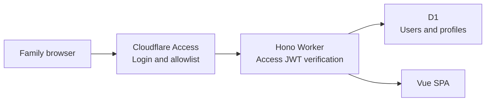

# Simple Cloudflare Family App Starter

[](https://github.com/txchen/simple_cfw_template/actions/workflows/ci.yml)

A full-stack Cloudflare starter for private family websites:

- **Cloudflare Access** handles login, sessions, and the allowlist.
- **Hono + Cloudflare Workers** provide the backend API.
- **D1** stores application-owned user profiles.
- **Vue 3 + Vite** provide the responsive frontend.
- Frontend and backend share one domain, so no separate CORS setup is needed.

The application stores no passwords and creates no second login session. After Cloudflare Access verifies a visitor, the Worker validates the Access JWT and finds or creates a D1 user by verified email address.



## Features

- Automatic user creation on first visit
- Current user and identity provider display
- Editable display name, avatar URL, and IANA timezone
- Configuration-driven administrator allowlist
- Administrator-only user directory page and API
- Valibot + Hono Standard Schema request validation
- Stable field validation and safe API error responses
- Cloudflare Access logout
- Localhost-only development identity
- Versioned D1 SQL migrations
- D1 integration tests inside the Workers runtime
- Responsive mobile and desktop layouts

## Project structure

```text
.
├── migrations/             # Versioned D1 schema
├── server/
│   ├── current-user.ts     # Access JWT, local identity, and D1 user module
│   ├── admin-role.ts       # Configured email allowlist and administrator check
│   ├── admin-users.ts      # Administrator user directory module
│   ├── profile.ts          # Schema issue to API error adapter
│   ├── app.ts              # Hono routes and error handling
│   └── index.ts            # Worker entry point
├── shared/                 # Shared contracts and Valibot schema
├── src/                    # Vue SPA
├── test/                   # Workers and local D1 integration tests
├── vite.config.ts
└── wrangler.jsonc
```

`current-user.ts` is the main identity seam. Hono routes call `resolve()` to obtain the current application user. Access JWT verification, localhost identity, automatic D1 provisioning, and Access subject updates after a user rejoins are encapsulated inside the module.

## Local development

Requires Node.js 20.19+ and a Cloudflare account.

```bash
npm install
cp .dev.vars.example .dev.vars
npm run db:migrate:local
npm run dev
```

Open the localhost URL printed by Vite. The default local user is:

```text
developer@example.com
```

This user is also a default local administrator. Override `LOCAL_DEV_USER_EMAIL` and the comma-separated `ADMIN_EMAILS` list in the untracked `.dev.vars` file as needed. Local identity requires both conditions:

- `AUTH_MODE` is `local` in `.dev.vars`.
- The request hostname is `localhost`, `127.0.0.1`, or `::1`.

Production configuration always uses `AUTH_MODE=access` and contains no local user email. A production request must carry a valid Access JWT even if its internal request URL uses a localhost hostname.

Wrangler persists local D1 state under `.wrangler/`. To rebuild local data, remove the relevant local development state and apply the migration again. Never use that reset procedure against the remote database.

## Cloudflare deployment

### 1. Log in to Wrangler

```bash
npx wrangler login
```

### 2. Create a D1 database

Rename the Worker and database after copying this starter, then create the database:

```bash
npx wrangler d1 create your-app-db
```

Copy the returned database ID into `wrangler.jsonc`:

```jsonc
{
  "name": "your-app",
  "d1_databases": [
    {
      "binding": "DB",
      "database_name": "your-app-db",
      "database_id": "your-real-database-id",
      "migrations_dir": "migrations"
    }
  ]
}
```

Apply the migration:

```bash
npm run db:migrate:remote
```

### 3. Create a Cloudflare Access application

Create a **Self-hosted application** in Cloudflare Zero Trust:

1. Enter the custom domain that the Worker will use, such as `family.example.com`.
2. Create an Allow policy containing only approved family email addresses.
3. Record the Access application's **AUD tag**.
4. Record the team domain, such as `https://your-team.cloudflareaccess.com`.

Add the values to `wrangler.jsonc`:

```jsonc
{
  "vars": {
    "AUTH_MODE": "access",
    "ADMIN_EMAILS": "first-parent@example.com,second-parent@example.com",
    "CF_ACCESS_TEAM_DOMAIN": "https://your-team.cloudflareaccess.com",
    "CF_ACCESS_AUD": "your-access-application-aud"
  }
}
```

The Access values are not passwords. Security comes from the JWT issued by Access, Cloudflare's signing keys, and the Worker's checks for issuer, audience, expiration, and token type.

### 4. Configure the Worker domain

The starter disables `workers.dev` and preview URLs to avoid alternate public addresses that bypass Access. Before deployment, configure a Custom Domain that exactly matches the Access application.

The recommended configuration lives in `wrangler.jsonc`:

```jsonc
{
  "routes": [
    {
      "pattern": "family.example.com",
      "custom_domain": true
    }
  ]
}
```

You may instead add the Custom Domain in the Cloudflare dashboard after deployment. Until the domain is connected, this fail-closed configuration exposes no public URL. The starter does not ship a route because every copied project uses a different domain.

Access should protect the entire website, not only `/api/*`, so HTML, JavaScript, and API requests all pass through Access first.

### 5. Deploy

```bash
npm run deploy
```

The deploy script runs type checking, integration tests, and a production build before invoking Wrangler.

## Identity and user records

Production requests must contain the Cloudflare-injected `Cf-Access-Jwt-Assertion`. The Worker:

1. Fetches Access JWKS from the team domain.
2. Verifies the RS256 signature.
3. Verifies the issuer and application audience.
4. Verifies expiration and `type === "app"`.
5. Reads the verified `sub` and email.
6. Finds or creates a D1 user by normalized email.

The application uses its own UUID as the user primary key. Email is the verified login identity, while `access_subject` retains the latest Access subject. If a family member is removed from Zero Trust and later added again, their Access subject may change. The next login finds the original profile by email and updates the subject.

Do not trust `Cf-Access-Authenticated-User-Email` by itself, and do not remove JWT verification from the Worker.

## Administrator

`ADMIN_EMAILS` contains a comma-separated administrator allowlist:

```jsonc
{
  "vars": {
    "ADMIN_EMAILS": "first-parent@example.com,second-parent@example.com"
  }
}
```

Comparisons are case-insensitive, surrounding whitespace is ignored, and authorization uses only the current user's JWT-verified email. Administrator status is never stored in D1, so database content cannot grant privileges. Change the allowlist by updating configuration and redeploying. The legacy `ADMIN_EMAIL` variable remains a fallback for existing deployments when `ADMIN_EMAILS` is absent.

The administrator page is available at:

```text
/admin
```

It lists every user who has entered the application and received a D1 record. Both `/admin` navigation and `/api/admin/*` enforce server-side administrator checks. Hiding a frontend link is only a user experience detail, not a security control.

## Logout behavior

The production logout button points to:

```text
/cdn-cgi/access/logout
```

Cloudflare clears the Access cookie. Access currently logs the user out of the entire team session, so other protected applications under the same team may also require a new login.

## Backend API

| Method | Path | Description |
| --- | --- | --- |
| `GET` | `/api/health` | Report Worker health |
| `GET` | `/api/me` | Verify identity and return or create the current user |
| `PATCH` | `/api/me/profile` | Update the current user's profile |
| `GET` | `/api/admin/users` | List all users for the administrator |

Profile request:

```json
{
  "displayName": "Hibiki",
  "avatarUrl": "https://example.com/avatar.png",
  "timezone": "America/Los_Angeles"
}
```

Each field may be `null` to clear it. Clients cannot submit a user ID, so profile updates always apply to the user identified by the JWT.

The runtime schema lives in `shared/profile.ts`, and the `ProfileUpdate` TypeScript type is inferred directly from it. Hono uses the schema through `@hono/standard-validator`. A project adapter converts validation issues into stable `422` field errors and preserves malformed JSON as a separate `400 invalid_json` response. The Standard Schema boundary also keeps routes independent from validator-specific middleware.

## Commands

| Command | Purpose |
| --- | --- |
| `npm run dev` | Start Vite in the Workers runtime |
| `npm run db:migrate:local` | Apply migrations to local D1 |
| `npm run db:migrate:remote` | Apply migrations to remote D1 |
| `npm run typecheck` | Check Vue, Worker, and build configuration types |
| `npm run test:run` | Run the Workers integration tests once |
| `npm run build` | Build the Worker and Vue assets |
| `npm run check` | Run type checking, tests, and production build |
| `npm run deploy` | Validate and deploy to Cloudflare |

## Copying this starter

At minimum, update:

1. The package name in `package.json`.
2. The Worker name in `wrangler.jsonc`.
3. The D1 database name and ID.
4. The Access team domain and AUD.
5. The production `ADMIN_EMAILS` allowlist.
6. The local development user and administrator allowlist in `.dev.vars`.
7. The page name, colors, and application-specific fields.

Keep `migrations/0001_create_users.sql` and the identity module, then add tables and `/api/*` routes for the family application.

## Security boundaries

- Cloudflare Access blocks visitors outside the allowlist.
- Worker JWT verification rejects forged ordinary request headers.
- D1 queries use only the verified current user ID.
- Administrator status comes only from configuration and verified email.
- Both `/admin` and `/api/admin/*` enforce server-side authorization.
- Local identity requires explicit `AUTH_MODE=local` and a loopback hostname.
- Production disables `workers.dev` and preview URLs.
- Profile updates use an allowlist of fields rather than arbitrary database keys.
- Cloudflare manages the Access cookie; Vue never reads or stores the token.
