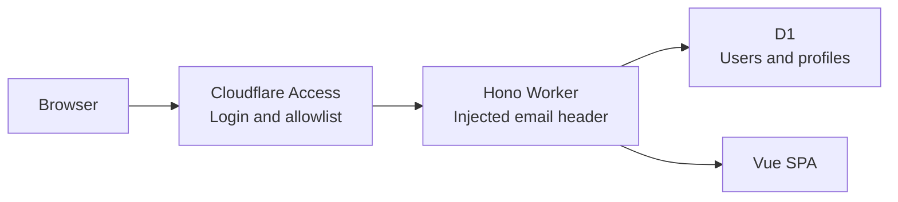

# Cloudflare Family App

[](https://github.com/txchen/simple_cfw_template/actions/workflows/ci.yml)

A private family profile application deployed at [cfwt.txchen.win](https://cfwt.txchen.win).

- **Cloudflare Access** handles login, sessions, and the entry allowlist.
- **Hono + Cloudflare Workers** provide the API.
- **D1** stores application-owned users and profiles.
- **Vue 3 + Vite+** provide the frontend and toolchain.

The application stores no passwords and creates no second login session. Cloudflare Access verifies each visitor and injects their email into the request; the Worker trusts that protected edge and resolves a D1 user by normalized email.



## Documentation

- [Local development and deployment runbook](docs/development-and-deployment.md)
- [Architecture and decisions](docs/architecture.md)

## Local development

Install Vite+, then open a new terminal:

```bash
curl -fsSL https://vite.plus | bash
```

Prepare and start the project:

```bash
vp install
cp .dev.vars.example .dev.vars
vp run db:migrate:local
vp dev
```

Open the URL printed by Vite+, normally `http://localhost:5173`.

Local authentication requires `AUTH_MODE=local` and uses `LOCAL_DEV_USER_EMAIL`. Loopback hostnames are allowed automatically. Trusted development hostnames or IP addresses can be listed explicitly in `LOCAL_DEV_ALLOWED_HOSTS`; every listed address receives the configured local identity without Cloudflare Access.

Local D1 state is persisted below `.wrangler/state/v3/d1/`. Workers integration tests use an isolated D1 database and do not modify local development data.

## Validation and deployment

Run the complete local gate:

```bash
vp run check
```

This runs Oxfmt, Oxlint, explicit Vue/TypeScript checks, Workers integration tests, and a production build.

When a release includes unapplied D1 migrations, review and apply them separately from deployment:

```bash
vp run db:migrate:remote
```

Deploy the already configured Worker, assets, D1 binding, and custom domain:

```bash
vp run deploy
```

See the [runbook](docs/development-and-deployment.md) for migration ordering, authentication profiles, and post-deployment verification.

## Identity and authorization

Production requests must contain `Cf-Access-Authenticated-User-Email`, which Cloudflare injects after Access allows the request. Missing identity returns `401`. The Worker does not independently verify an Access JWT, so the complete production hostname must remain protected by Access and alternate public routes must remain disabled.

`ADMIN_EMAILS` is a comma-separated application administrator allowlist. It does not grant entry through Cloudflare Access; an administrator must also be allowed by the Access policy. Administrator checks are enforced on the server for `/admin` and `/api/admin/*`.

The production logout link is `/cdn-cgi/access/logout` and clears the Cloudflare Access team session.

## API

| Method  | Path               | Description                                 |
| ------- | ------------------ | ------------------------------------------- |
| `GET`   | `/api/health`      | Report Worker health                        |
| `GET`   | `/api/me`          | Resolve or create the current user          |
| `PATCH` | `/api/me/profile`  | Update the current user's profile           |
| `GET`   | `/api/admin/users` | List users for an application administrator |

Profile update fields are optional and may be `null` to clear them:

```json
{
  "displayName": "Hibiki",
  "avatarUrl": "https://example.com/avatar.png",
  "timezone": "America/Los_Angeles"
}
```

## Commands

| Command                    | Purpose                                                           |
| -------------------------- | ----------------------------------------------------------------- |
| `vp install`               | Install dependencies with the pinned package manager              |
| `vp dev`                   | Start the application in the local Workers runtime                |
| `vp check`                 | Check formatting and lint rules                                   |
| `vp run typecheck`         | Check Vue, Worker, and configuration types                        |
| `vp test`                  | Run Workers and isolated D1 integration tests                     |
| `vp build`                 | Build Worker and client assets                                    |
| `vp run check`             | Run formatting, linting, type checks, tests, and production build |
| `vp run db:migrate:local`  | Apply pending migrations to local D1                              |
| `vp run db:migrate:remote` | Apply pending migrations to production D1                         |
| `vp run deploy`            | Validate and deploy to Cloudflare                                 |
| `vp run cf-typegen`        | Regenerate Cloudflare binding types                               |

## Project structure

```text
migrations/     Versioned D1 schema changes
server/         Hono routes, users, authorization, and errors
shared/         Browser/Worker contracts and runtime profile schema
src/            Vue shell, pages, API client, and page-local styles
test/           Identity, profile, admin, and API-client integration tests
docs/           Architecture and operational runbook
```

## Security invariants

- Cloudflare Access protects the entire production hostname.
- `workers.dev` and preview URLs remain disabled.
- The Worker trusts only the email header injected at that protected edge.
- Administrator status comes only from `ADMIN_EMAILS`, never from D1 data.
- Profile updates are scoped to the resolved current user and allowlisted fields.
- Local identity requires explicit local mode and a loopback or explicitly trusted hostname.
