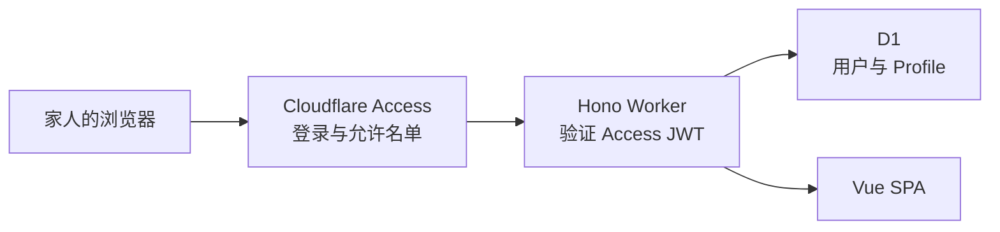

# Simple Cloudflare Family App Starter

一套用于家庭内部网站的 Cloudflare 全栈模板：

- **Cloudflare Access** 负责登录、会话和允许名单
- **Hono + Cloudflare Workers** 提供后端接口
- **D1** 保存应用自己的用户 Profile
- **Vue 3 + Vite** 提供响应式前端
- 同一个域名部署前后端，不需要额外处理 CORS

应用不保存密码，也不创建第二套登录 session。Cloudflare Access 确认访问者身份后，Worker 验证 Access JWT，再根据已验证的 email 在 D1 中查找或自动创建用户。



## 已有功能

- 第一次访问时自动建立用户记录
- 显示当前登录用户及身份来源
- 编辑显示名称、头像网址和 IANA 时区
- 配置驱动的单一 Admin 身份
- 仅 Admin 可访问的用户列表页面和接口
- Profile 字段校验与安全错误响应
- Cloudflare Access logout
- 仅限 localhost 的本地开发身份
- D1 SQL migration
- Workers 运行时中的 D1 集成测试
- 手机与桌面响应式页面

## 项目结构

```text
.
├── migrations/             # 版本化 D1 schema
├── server/
│   ├── current-user.ts     # Access JWT + 本地身份 + D1 用户模块
│   ├── admin-role.ts       # 配置 email 与 Admin 身份判定
│   ├── admin-users.ts      # Admin 用户目录查询模块
│   ├── profile.ts          # Profile 输入校验
│   ├── app.ts              # Hono 路由与错误处理
│   └── index.ts            # Worker entry
├── shared/                 # 前后端共用的数据契约
├── src/                    # Vue SPA
├── test/                   # Workers + 本地 D1 集成测试
├── vite.config.ts
└── wrangler.jsonc
```

`current-user.ts` 是身份模块的主要 seam。Hono 路由只需要调用 `resolve()` 获得当前应用用户；Access JWT 验证、localhost 身份、D1 自动建档以及重新加入 Access 后的 subject 更新都封装在模块内部。

## 本地开始

需要 Node.js 20.19+ 和一个 Cloudflare 账号。

```bash
npm install
cp .dev.vars.example .dev.vars
npm run db:migrate:local
npm run dev
```

打开 Vite 输出的 localhost 地址。默认本地用户是：

```text
developer@example.com
```

它同时是默认的本地 Admin。可以在未提交到 Git 的 `.dev.vars` 中分别修改 `LOCAL_DEV_USER_EMAIL` 和 `ADMIN_EMAIL`。本地身份必须同时满足：

- `.dev.vars` 中的 `AUTH_MODE` 是 `local`
- 请求 hostname 是 `localhost`、`127.0.0.1` 或 `::1`

生产配置固定使用 `AUTH_MODE=access`，而且不包含本地用户 email。即使生产环境收到一个使用 localhost URL 构造的内部请求，也仍然必须携带有效的 Access JWT。

本地 D1 数据默认由 Wrangler 持久化到 `.wrangler/`。需要重建时，可以删除对应的本地开发数据，再重新执行 migration；不要对远程数据库使用这种做法。

## Cloudflare 部署配置

### 1. 登录 Wrangler

```bash
npx wrangler login
```

### 2. 创建 D1 数据库

复制项目后，先给 Worker 和数据库改名：

```bash
npx wrangler d1 create your-app-db
```

将输出的 database ID 写入 `wrangler.jsonc`：

```jsonc
{
  "name": "your-app",
  "d1_databases": [
    {
      "binding": "DB",
      "database_name": "your-app-db",
      "database_id": "这里填写真实 database ID",
      "migrations_dir": "migrations"
    }
  ]
}
```

应用 migration：

```bash
npm run db:migrate:remote
```

### 3. 创建 Cloudflare Access 应用

在 Cloudflare Zero Trust 中创建一个 **Self-hosted application**：

1. 填写准备给 Worker 使用的自定义域名，例如 `family.example.com`
2. 创建 Allow policy，只包含获准访问的家庭成员 email
3. 记下 Access application 的 **AUD tag**
4. 记下团队域名，例如 `https://your-team.cloudflareaccess.com`

将它们写入 `wrangler.jsonc`：

```jsonc
{
  "vars": {
    "AUTH_MODE": "access",
    "ADMIN_EMAIL": "your-email@example.com",
    "CF_ACCESS_TEAM_DOMAIN": "https://your-team.cloudflareaccess.com",
    "CF_ACCESS_AUD": "Access application 的 AUD tag"
  }
}
```

这两个 Access 值不是密码。真正的安全性来自 Access 签发的 JWT、Cloudflare 的签名密钥以及 Worker 对 issuer、audience、有效期和 token 类型的验证。

### 4. 配置 Worker 域名

模板默认关闭 `workers.dev` 和 preview URLs，避免出现绕过 Access 的备用公开地址。因此部署前需要给 Worker 配置与 Access application 完全一致的 Custom Domain。

推荐在 `wrangler.jsonc` 中维护：

```jsonc
{
  "routes": [
    {
      "pattern": "family.example.com",
      "custom_domain": true
    }
  ]
}
```

也可以部署 Worker 后在 Cloudflare Dashboard 中添加 Custom Domain；在完成绑定之前，这个 fail-closed 配置不会提供公开访问地址。复制 starter 时域名各不相同，因此模板没有预置 route。

Access 应覆盖整个网站，而不只是 `/api/*`。这样 HTML、JavaScript 和接口都会先经过 Access。

### 5. 部署

```bash
npm run deploy
```

`deploy` 会先执行类型检查、集成测试和生产构建，全部通过后才调用 Wrangler。

## 身份与用户记录

生产请求必须带有 Cloudflare 注入的 `Cf-Access-Jwt-Assertion`。Worker 会：

1. 从团队域名读取 Access JWKS
2. 验证 RS256 签名
3. 验证 issuer 和应用 AUD
4. 验证有效期以及 `type === "app"`
5. 读取经过验证的 `sub` 和 email
6. 按规范化后的 email 查找或创建 D1 用户

应用使用自己的 UUID 作为用户主键。email 是已验证的登录身份，`access_subject` 会保留最新的 Access subject。家庭成员从 Zero Trust 删除后再重新加入时，Access subject 可能改变；再次登录会按 email 找回原 Profile 并更新 subject。

不要将 `Cf-Access-Authenticated-User-Email` 单独作为可信身份，也不要删除 Worker 中的 JWT 校验。

## Admin

`ADMIN_EMAIL` 指定唯一的 Admin：

```jsonc
{
  "vars": {
    "ADMIN_EMAIL": "your-email@example.com"
  }
}
```

Admin 判断大小写不敏感，并且只使用已经通过 Access JWT 验证的当前用户 email。Admin 身份不会写进 D1，因此数据库内容不能提升用户权限；修改 Admin 只需要更新配置并重新部署。

Admin 可以访问：

```text
/admin
```

页面列出所有已经进入过应用并在 D1 创建记录的用户。`/admin` 导航和 `/api/admin/*` 都由 Worker 进行 server-side Admin 检查；前端隐藏链接只是 UX，不是安全机制。

## Logout 行为

生产页面的退出按钮指向：

```text
/cdn-cgi/access/logout
```

Cloudflare 会清理 Access cookie。Cloudflare Access 当前的用户 logout 会退出整个 Access 会话，而不是只退出这一个应用；其他受同一团队保护的应用也可能需要重新登录。

## 后端接口

| Method | Path | 说明 |
| --- | --- | --- |
| `GET` | `/api/health` | Worker 健康状态 |
| `GET` | `/api/me` | 验证身份并返回或创建当前用户 |
| `PATCH` | `/api/me/profile` | 更新当前用户的 Profile |
| `GET` | `/api/admin/users` | Admin 专用：列出全部用户 |

Profile 请求：

```json
{
  "displayName": "Hibiki",
  "avatarUrl": "https://example.com/avatar.png",
  "timezone": "America/Los_Angeles"
}
```

每个字段都可以传 `null` 清空。客户端不能提交 user ID，因此 Profile 更新始终作用于 JWT 对应的当前用户。

## 常用命令

| 命令 | 用途 |
| --- | --- |
| `npm run dev` | 在 Workers runtime 中启动 Vite 开发环境 |
| `npm run db:migrate:local` | 对本地 D1 应用 migration |
| `npm run db:migrate:remote` | 对远程 D1 应用 migration |
| `npm run typecheck` | 检查 Vue、Worker 和构建配置类型 |
| `npm run test:run` | 在 Workers runtime 中运行一次测试 |
| `npm run build` | 构建 Worker 和 Vue 资产 |
| `npm run check` | 类型检查、测试和生产构建 |
| `npm run deploy` | 验证后部署到 Cloudflare |

## 复制成新项目时

至少修改以下内容：

1. `package.json` 中的 package name
2. `wrangler.jsonc` 中的 Worker name
3. D1 database name 和 ID
4. Access team domain 和 AUD
5. 生产 `ADMIN_EMAIL`
6. `.dev.vars` 中的本地开发用户与 Admin email
7. 页面名称、配色和实际业务字段

保留 `migrations/0001_create_users.sql` 和身份模块，就可以在此基础上增加家庭应用自己的表和 `/api/*` 路由。

## 安全边界

- Cloudflare Access 是第一层：阻止非允许用户取得网站内容
- Worker JWT 验证是第二层：不信任可伪造的普通请求 header
- D1 查询只使用验证后的当前用户 ID
- Admin 身份只来自配置与已验证 email，不接受数据库或客户端角色字段
- `/admin` 页面和 `/api/admin/*` 接口都执行 server-side authorization
- 本地身份同时要求显式 `AUTH_MODE=local` 和 loopback hostname
- 生产关闭 `workers.dev` 与 preview URLs，只保留受 Access 保护的自定义域名
- Profile 更新采用字段白名单，不接受任意数据库字段
- Access cookie 由 Cloudflare 管理，Vue 不读取或保存 token
